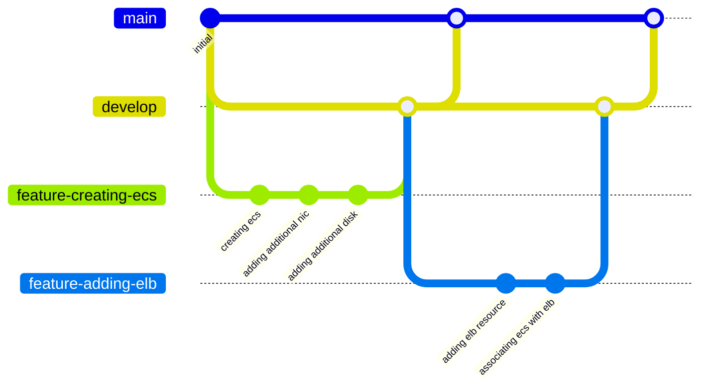

# policy-as-code-lab

```mermaid
    gitGraph
       commit id: "initial"
       branch develop
       checkout develop
       branch feature-creating-ecs
       checkout feature-creating-ecs
       commit id: "creating ecs"
       commit id: "adding additional nic"
       commit id: "adding additional disk"
       checkout develop
       merge feature-creating-ecs
       checkout main
       merge develop
       checkout develop
       branch feature-adding-elb
       commit id: "adding elb resource"
       commit id: "associating ecs with elb"
       checkout develop
       merge feature-adding-elb
       checkout main
       merge develop
```