# policy-as-code-lab

## Creating Backend for terraform
In this workshop, Huawei Cloud OBS is used as the backend of terraform

1. Log into [Huawei Cloud](https://www.huaweicloud.com/) using the account provided by the organizer.

2. On the console, search the `OBS` service in the search box and select the `Object Storage Service`
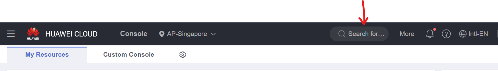

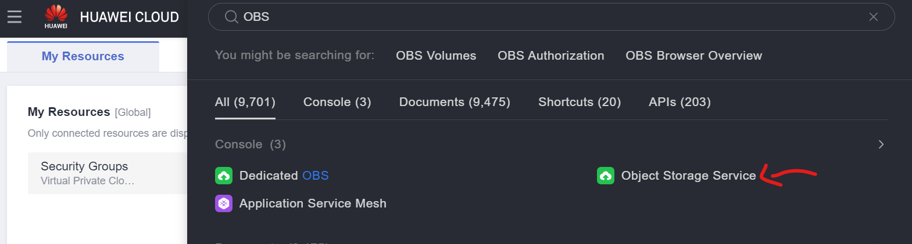

3. On the `Object Storage Service` page, Click `Create Bucket` button on the top right corner of the page
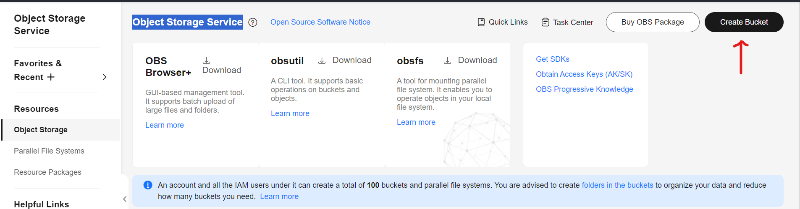

4. On the bucket creation page, only need to provide a uniq bucket name and leave other parameters unchanged
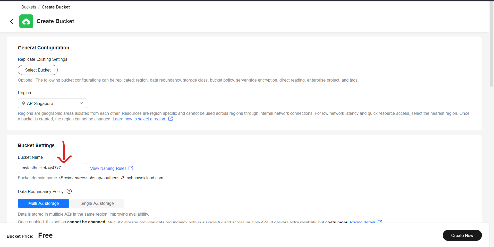

## Create AK/SK
1. Log into [Huawei Cloud](https://www.huaweicloud.com/) using the account provided by the organizer.

2. On the top right corner of the page, Click the `Account Name` and Select `My Credentials`
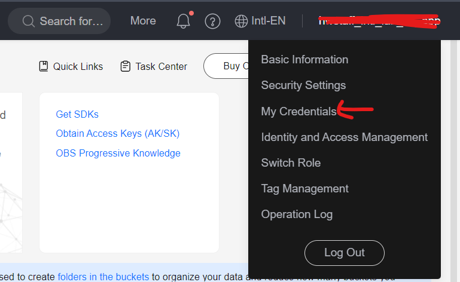

3. On the Credentials page, select `Access Keys` from the panel on the left side of the page and Click `Create Access Key`
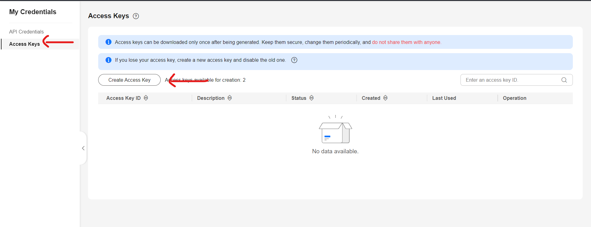

4. After the Access Key is created, download the key to your desktop
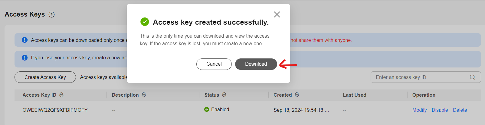

## Create Code Repo
1. Log into [Huawei Cloud](https://www.huaweicloud.com/) using the account provided by the organizer.

2. On the console, search the `CodeArts` service in the search box and select the `CodeArts`
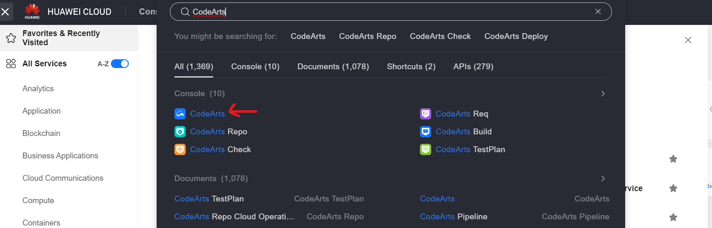

3. On the `CodeArts` Page, Click `Access Service` on the top right corner of the page
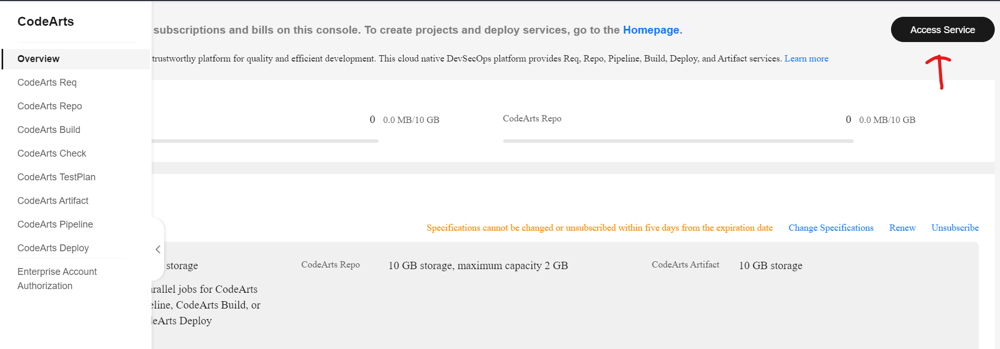

4. On the Service page, Select `Scrum` template to create a project
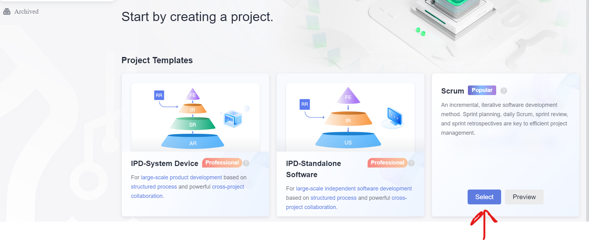

5. On the Creation Page, You only need to change the `Name`
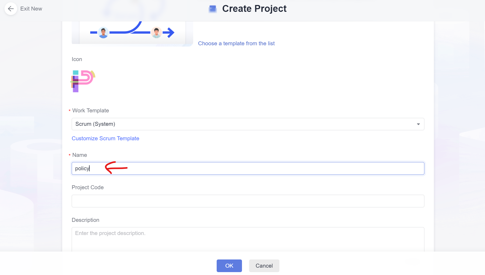

6. On the newly created project page, Select `Code` -> `Repo`
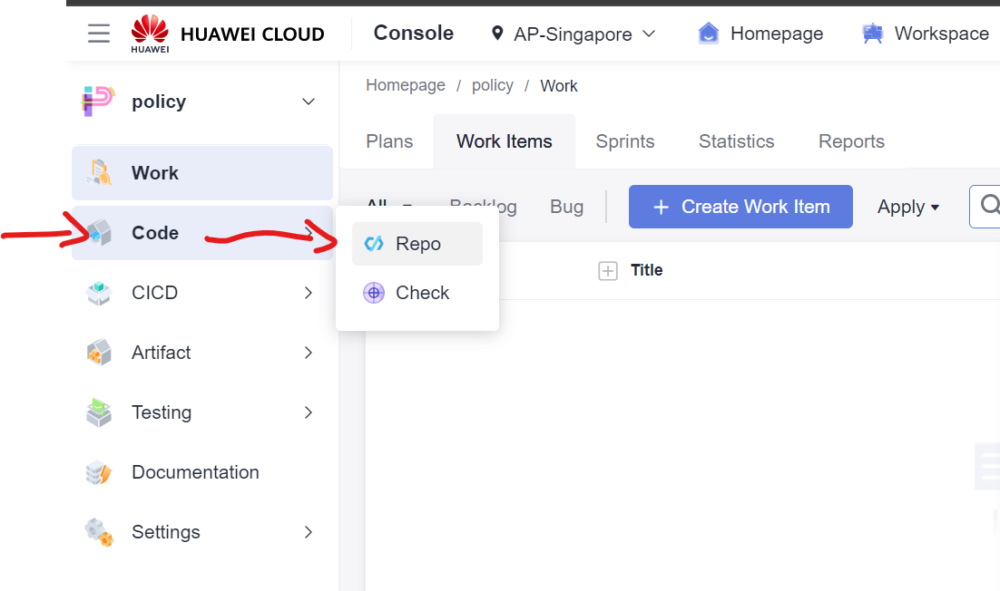

7. On the `Repo` page, Click `New Repository` to create a Repo
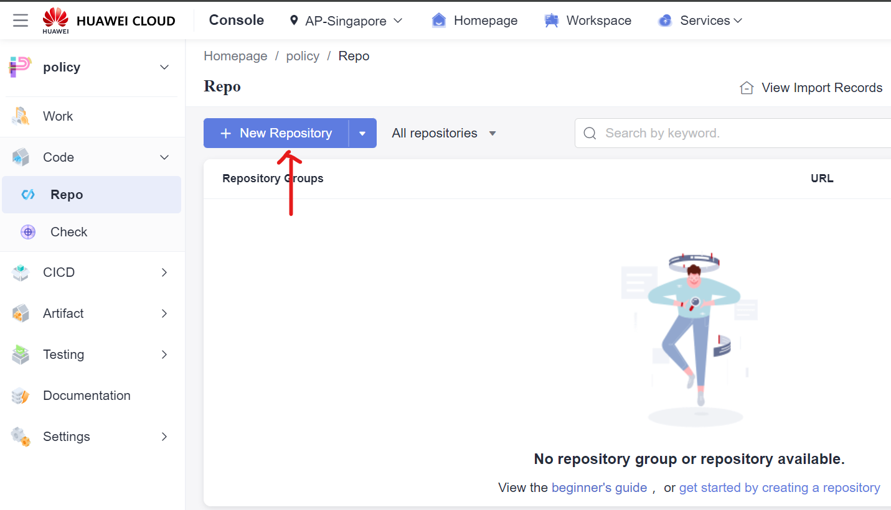

8. Select `Import` as `Repository Type`
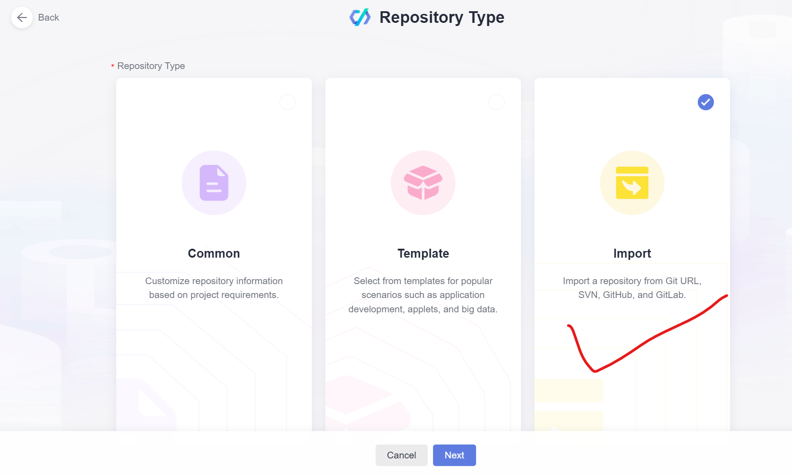

9. Select `Import From` as `Git Url` and Use the repository url: ```https://github.com/Huawei-APAC-Professional-Services/policy-as-code-lab.git```
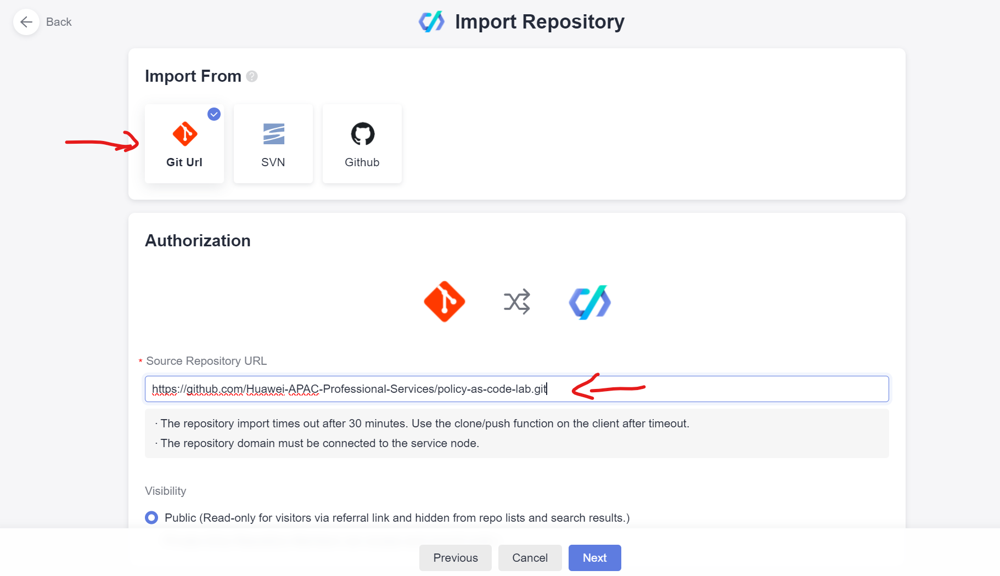

10. In the next step. keep the information as it appears and Click `Ok`


