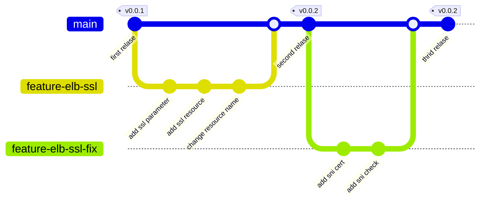

# policy-as-code-lab

```mermaid
    gitGraph
       commit id: "first relase" tag: "v0.0.1"
       branch feature-elb-ssl
       checkout feature-elb-ssl
       commit id: "add ssl parameter"
       commit id: "add ssl resource"
       commit id: "change resource name"
       checkout main
       merge feature-elb-ssl
       commit id: "second relase" tag: "v0.0.2"
       branch feature-elb-ssl-fix
       checkout feature-elb-ssl-fix
       commit id: "add sni cert"
       commit id: "add sni check"
       checkout main
       merge feature-elb-ssl-fix
       commit id: "thrid relase" tag: "v0.0.2"
```