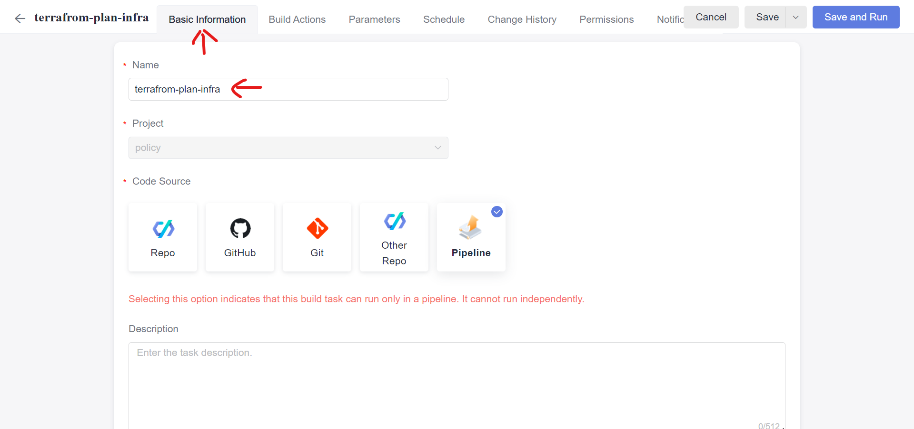
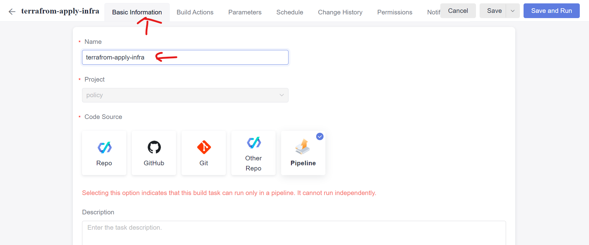

# policy-as-code-lab

## Creating Backend for terraform
In this workshop, Huawei Cloud OBS is used as the backend of terraform

1. Log into [Huawei Cloud](https://www.huaweicloud.com/) using the account provided by the organizer.

2. On the console, search the `OBS` service in the search box and select the `Object Storage Service`


3. On the `Object Storage Service` page, Click `Create Bucket` button on the top right corner of the page


4. On the bucket creation page, only need to provide a uniq bucket name and leave other parameters unchanged


## Create AK/SK
1. Log into [Huawei Cloud](https://www.huaweicloud.com/) using the account provided by the organizer.

2. On the top right corner of the page, Click the `Account Name` and Select `My Credentials`


3. On the Credentials page, select `Access Keys` from the panel on the left side of the page and Click `Create Access Key`


4. After the Access Key is created, download the key to your desktop


## Create Code Repo
1. Log into [Huawei Cloud](https://www.huaweicloud.com/) using the account provided by the organizer.

2. On the console, search the `CodeArts` service in the search box and select the `CodeArts`


3. On the `CodeArts` Page, Click `Access Service` on the top right corner of the page


4. On the Service page, Select `Scrum` template to create a project


5. On the Creation Page, You only need to change the `Name`


6. On the newly created project page, Select `Code` -> `Repo`


7. On the `Repo` page, Click `New Repository` to create a Repo


8. Select `Import` as `Repository Type`


9. Select `Import From` as `Git Url` and Use the repository url: ```https://github.com/Huawei-APAC-Professional-Services/policy-as-code-lab.git```


10. In the next step. keep the information as it appears and Click `Ok`


## Update Codes
1. On the `Code` page, Select `Infrastructure` folder


2. Find the `provider.tf` file in the folder and Click `Edit`


3. Update the Terraform backend configuration by providing the name of the bucket you created in [Creating Backend for terraform](#creating-backend-for-terraform)


4. Select the `Application` folder and `Edit` `provider.tf` file


5. Update the Terraform backend configuration and remote data by providing the name of the bucket you created in [Creating Backend for terraform](#creating-backend-for-terraform)


## Creating Service Endpoint
1. On the top right corner of the CodeArts service, Click the profile icon and Select `This Account Settings`


2. On the left side panel, Select `Repo` -> `HTTPS Password`


3. Change the `HTTPS Password` to `Use Huawei Cloud login password` if it's not the value and Copy the username


4. Go back to project page and Select `Settings` -> `General` on the left side panel


5. On the new page, Select `Service Endpoints` -> `CodeArts Repo HTTPS`


6. Provide the following information for creating Endpoint
   * Service Endpoint Name: any
   * CodeArts Repo URL: You can copy it from repository information
   * Username: Copied value from step 3
   * Password: The password provided by Organizer


## Creating Terraform Validation Job
1. On the `CodeArts` service page, Select `CICD` -> `Build` -> `Create Task`


2. On the creation page, use `terrafrom-validation` and click `Next` and Select `Shell` template


3. On the task page, Click `...` on the right of job name and Select `Delete` to delete the job


4. On the left side panel, Click `Add Build Actions` to add a new action, in the action list, Select `Use SWR Public Image`


5. Provide the following parameters for the job
   * `Action Name`: ```Terrafrom Validation```
   * `Image Address`: ```swr.ap-southeast-3.myhuaweicloud.com/core/ubuntu:codearts1```
   * `Commands`:
      ````
      export HW_ACCESS_KEY=${HW_ACCESS_KEY}
      export HW_SECRET_KEY=${HW_SECRET_KEY}
      export AWS_ACCESS_KEY_ID=${HW_ACCESS_KEY}
      export AWS_SECRET_ACCESS_KEY=${HW_SECRET_KEY}
      terraform -chdir=infrastructure init
      terraform -chdir=infrastructure validate
      terraform -chdir=application init
      terraform -chdir=application validate
      ```


6. Select the `Parameters` tab on the top of the page and Create the following two parameters with empty value and enable the `Runtime Settings`
   * Name: `HW_ACCESS_KEY`
   * Name: `HW_SECRET_KEY`


7. Save the task

## Creating Checkov Validation Job
1. On the `CodeArts` service page, Select `CICD` -> `Build` -> `Create Task`


2. On the creation page, use `checkov-validation` and click `Next` and Select `Shell` template


3. On the task page, Click `...` on the right of job name and Select `Delete` to delete the job


4. On the left side panel, Click `Add Build Actions` to add a new action, in the action list, Select `Use SWR Public Image`


5. Provide the following parameters for the job
   * `Action Name`: ```Checkov Validation```
   * `Image Address`: ```swr.ap-southeast-3.myhuaweicloud.com/core/ubuntu:codearts1```
   * `Commands`:
      ````
      checkov -d infrastructure --download-external-modules true --external-checks-git https://github.com/Huawei-APAC-Professional-Services/terraform-policy.git
      checkov -d application --download-external-modules true --external-checks-git https://github.com/Huawei-APAC-Professional-Services/terraform-policy.git
      ```
6. Save the task

## Creating Terraform Plan Job
1. On the `CodeArts Build` Page, Click the `...` icon on the `terraform-validation` job to Clone a new job


2. Select `Basic Information` tab on the top of the page and Change the name to `terrafrom-plan`


3. Select the `Build Actions` tab and the `Terrafrom Validation` job on the left side panel and Change the following the following parameters for the job
   * `Action Name`: ```Terrafrom Plan```
   * `Image Address`: ```swr.ap-southeast-3.myhuaweicloud.com/core/ubuntu:codearts1```
   * `Commands`:
      ````
      export HW_ACCESS_KEY=${HW_ACCESS_KEY}
      export HW_SECRET_KEY=${HW_SECRET_KEY}
      export AWS_ACCESS_KEY_ID=${HW_ACCESS_KEY}
      export AWS_SECRET_ACCESS_KEY=${HW_SECRET_KEY}
      terraform -chdir=infrastructure init
      terraform -chdir=infrastructure plan
      terraform -chdir=application init
      terraform -chdir=application plan
      ```

4. Save the task

## Creating Terraform Apply Job
1. On the `CodeArts Build` Page, Click the `...` icon on the `terraform-validation` job to Clone a new job


2. Select `Basic Information` tab on the top of the page and Change the name to `terrafrom-apply`


3. Select the `Build Actions` tab and the `Terrafrom Validation` job on the left side panel and Change the following the following parameters for the job
   * `Action Name`: ```Terrafrom Apply```
   * `Image Address`: ```swr.ap-southeast-3.myhuaweicloud.com/core/ubuntu:codearts1```
   * `Commands`:
      ````
      export HW_ACCESS_KEY=${HW_ACCESS_KEY}
      export HW_SECRET_KEY=${HW_SECRET_KEY}
      export AWS_ACCESS_KEY_ID=${HW_ACCESS_KEY}
      export AWS_SECRET_ACCESS_KEY=${HW_SECRET_KEY}
      terraform -chdir=infrastructure init
      terraform -chdir=infrastructure apply -auto-approve
      terraform -chdir=application init
      terraform -chdir=application apply -auto-approve
      ```

4. Save the task

## Creating Deployment Pipeline
1. On the `CodeArts` service page, Select `CICD` -> `Pipeline`


2. On the `Pipeline` page, Click `Create Pipeline` button


3. Providing the information to create pipeline


4. Select a `Blank Template` for this pipeline


5. After the pipeline is created, Select `Parameter Configurations` on the top of page


6. Set the following parameters with the credentials created in [Create AK/SK](#create-aksk)
```HW_ACCESS_KEY``` 
```HW_SECRET_KEY```


7. Change to `Task Orchestration` tab and click `Edit` icon to modify the stage name to `Validation`


8. Click `New Job` to create a build job, for the job type, select `Build`


9. On the job configuration page, select the `terraform-validation` task and `policy-as-code-lab` repository, for the following parameters, using the following values.
   * Name: `terraform validation`
   * HW_ACCESS_KEY: `${HW_ACCESS_KEY}`
   * HW_SECRET_KEY: `${HW_SECRET_KEY}`


10. On the pipeline page, Click `+Parallel Job` to add another job under `Validation` stage


11. On the job configuration page, providing the following parameters:
   * Name: `checkov validation`
   * Select Task: `checkov-validation`
   * Repository: `policy-as-code-lab`


12. On the pipeline configuration page, Click `+Stage` to create a `Plan` stage


13. Under the `Plan` stage, add a `terraform plan` job, to configure the job with the following parameters:
   * Name: `terraform plan`
   * Select Task: `terraform-plan`
   * Repository: `policy-as-code-lab`
   * HW_ACCESS_KEY: `${HW_ACCESS_KEY}`
   * HW_SECRET_KEY: `${HW_SECRET_KEY}`


14. On the pipeline configuration page, Click `+Stage` to create a `Deployment` stage


15. Under the `Deployment` stage, add a `terraform apply` job, to configure the job with the following parameters:
   * Name: `terraform apply`
   * Select Task: `terraform-apply`
   * Repository: `policy-as-code-lab`
   * HW_ACCESS_KEY: `${HW_ACCESS_KEY}`
   * HW_SECRET_KEY: `${HW_SECRET_KEY}`


16. On the pipeline page, Click `Save and Execute` to run the pipeline


