# Solutions
Policy-as-code is a method of defining and managing security rules, criteria, and conditions through code. It is a way of enforcing security and risk policies programmatically, within a continuous integration/continuous delivery/continuous deployment (CI/CD) pipeline. 

The Policies usually represent the best practices or regulation and organization requirement which is unlikely to be changed frequently. So when the pipeline is aborted by policy checking, it usually means that we need to modify our codes to make it conform to the policy.

Without specific elaboration, the following updates are all made in the `policy-as-code-lab` repo

## Fix failed check on terraform module source

This solution will fix the following failed checks
* Check: CKV_TF_1: "Ensure Terraform module sources use a commit hash"
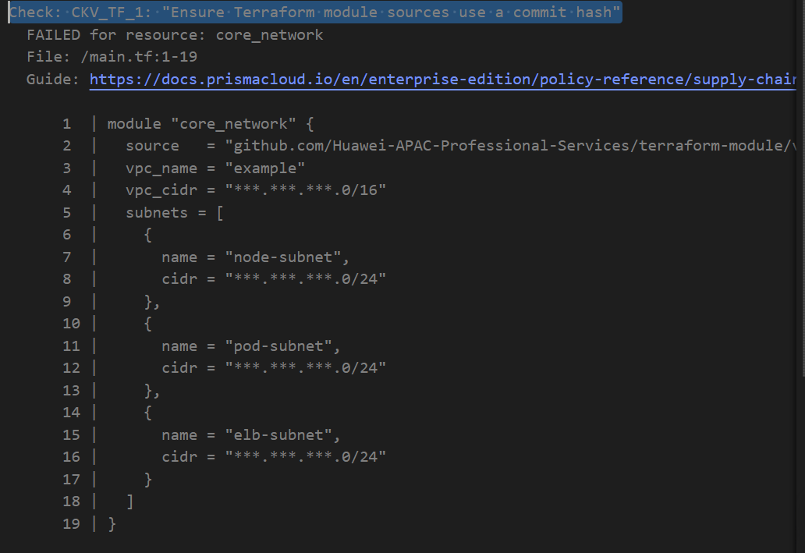

* Check: CKV_TF_2: "Ensure Terraform module sources use a tag with a version number"
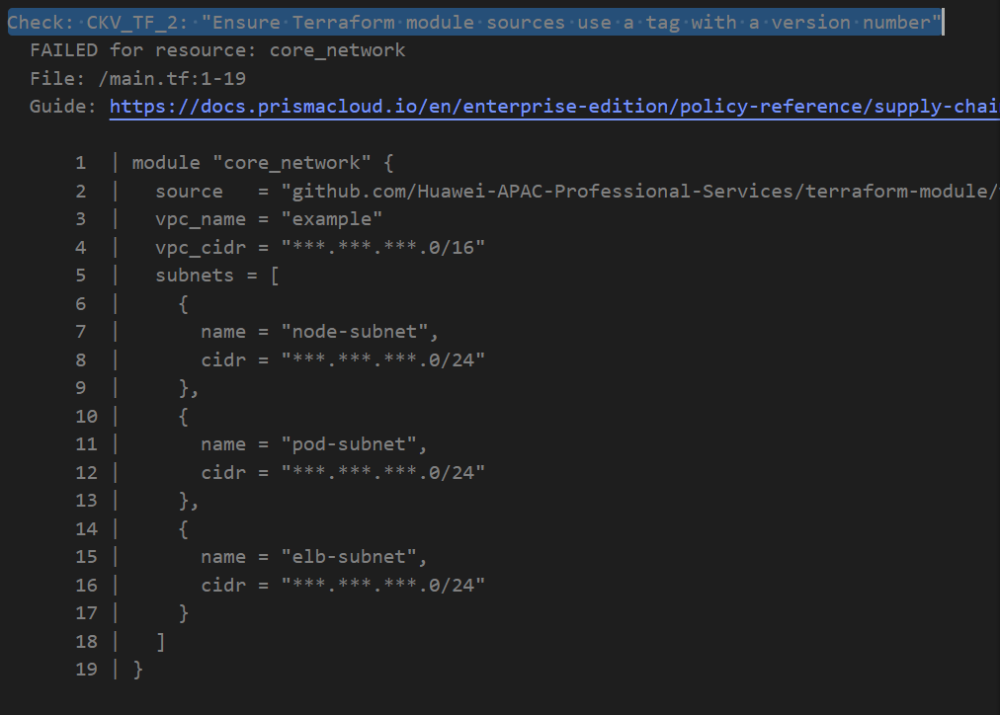

### Guidance
Open the `main.tf` file under `Infrastructure` folder. Click `Edit` icon to change the value of `source` parameter of `core_network` module to the following 
```
git::https://github.com/Huawei-APAC-Professional-Services/terraform-module.git//vpc?ref=3066f775dc65dd382b9f60262cc6a1be0df15d1f
```

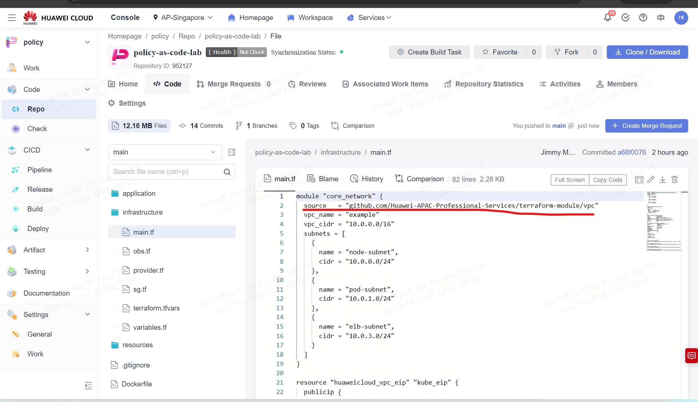

## Fix failed check on EIP Bandwidth

This solution will fix the following failed checks
* ckv_hwc_300: "Ensure bandwidth of EIP is less than 200"
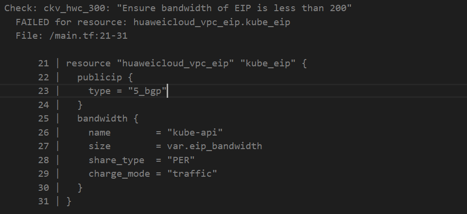

### Guidance
Open the `terraform.tfvars` file under `Infrastructure` folder. Click `Edit` icon to change the value of `eip_bandwidth` to 150
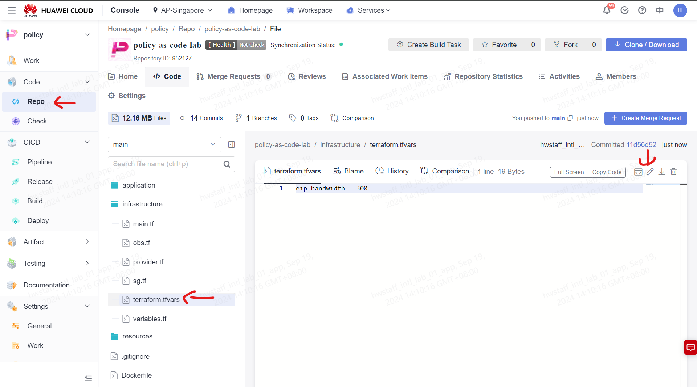

## Fix failed check on Region Limitation

This solution will fix the following failed checks
* CKV_HWC_Region_2: "Ensure Only Approved Region is configured within provider"
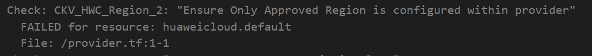

* CKV_HWC_REGION_1: "Ensure only allowed regions are configured"
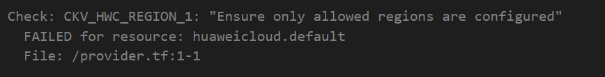


### Guidance
Open the `provider.tf` file under `Infrastructure` folder. Click `Edit` icon to change `region` parameter to `ap-southeast-3` 


## Fix failed check on Tags

This solution will fix the following failed checks
* CKV_HWC_TAGS_1: "Ensure CostCenter tag is in place"
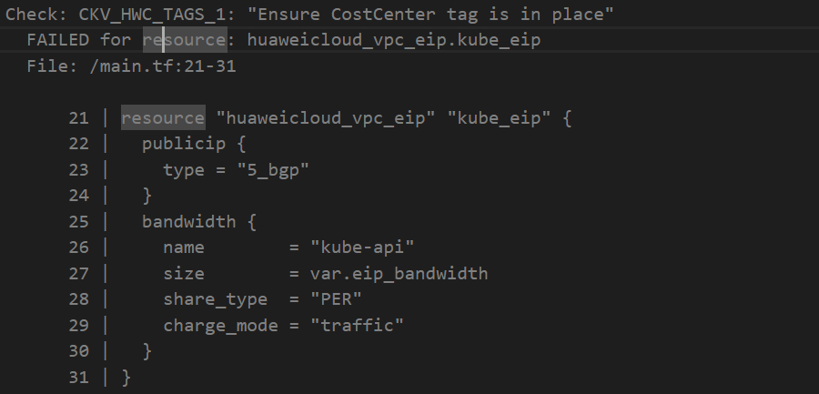
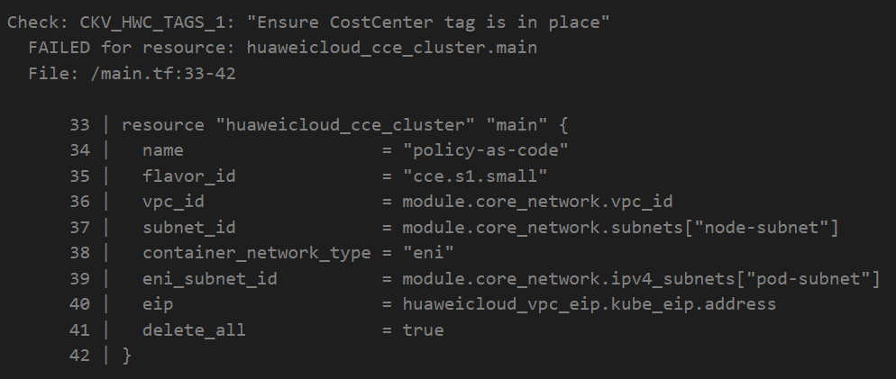

### Guidance
Open the `main.tf` file under `Infrastructure` folder. Click `Edit` icon to add `tags` parameter to `kube_eip` resources

```
tags = {
  CostCenter = "10010"
}
```
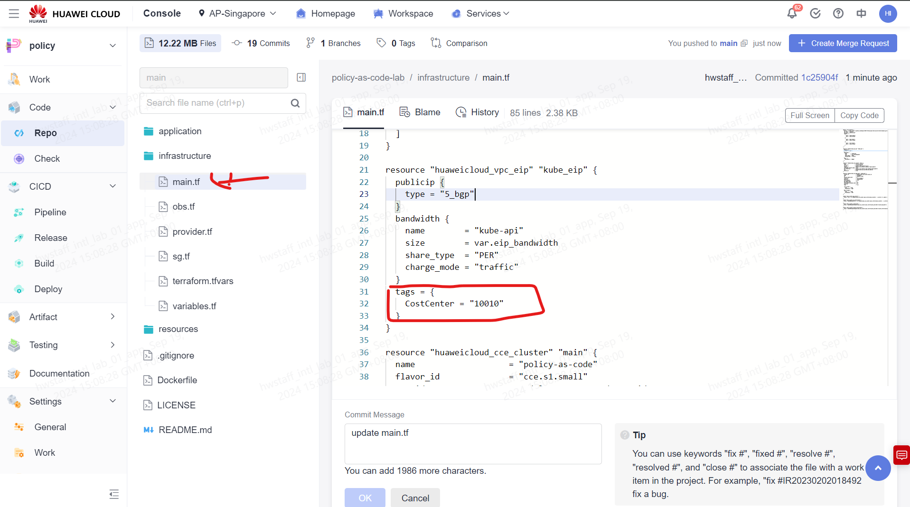

Open the `main.tf` file under `Infrastructure` folder. Click `Edit` icon to add `tags` parameter to `huaweicloud_cce_cluster.main` resource
```
tags = {
  CostCenter = "10010"
}
```
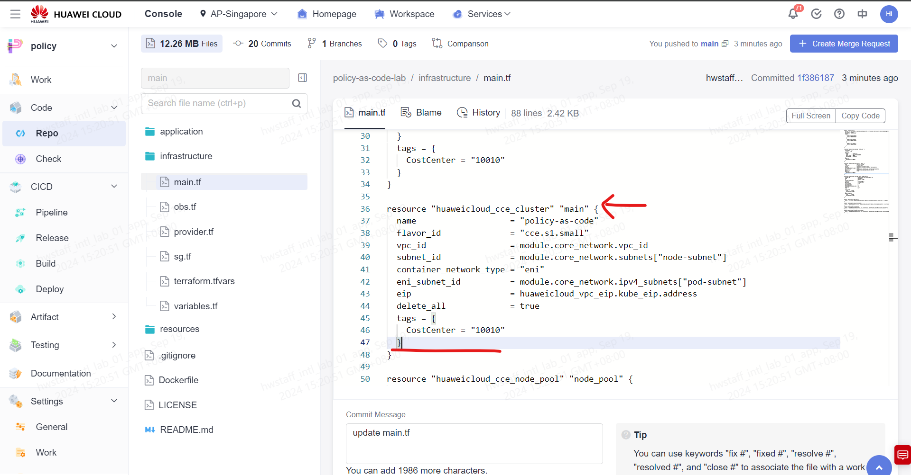

